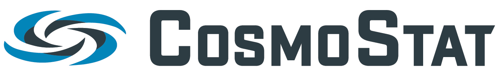
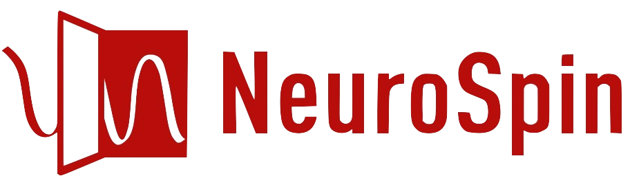

About
=====

ModOpt was developed as part of |link-to-cosmic|, a multi-disciplinary collaboration
between |link-to-neurospin|, experts in biomedical imaging, and |link-to-cosmostat|,
experts in astrophysical image processing. The package was
designed to provide the backend optimisation algorithms for
|link-to-pysap| :cite:`farrens:2020`, but also serves as a stand-alone library
of inverse problem solving tools. While PySAP aims to provide
application-specific tools for solving complex imaging problems, ModOpt can in
principle be applied to any linear inverse problem.

Contributors
------------

You can find a |link-to-contributors|.

|CS_LOGO| |NS_LOGO|

.. |link-to-cosmic| raw:: html

  <a href="http://cosmic.cosmostat.org/" target="_blank">COSMIC</a>

.. |link-to-neurospin| raw:: html

  <a href="https://joliot.cea.fr/drf/joliot/en/Pages/research_entities/NeuroSpin.aspx"
  target="_blank">NeuroSpin</a>

.. |link-to-cosmostat| raw:: html

  <a href="http://www.cosmostat.org/"
  target="_blank">CosmoStat</a>

.. |link-to-pysap| raw:: html

  <a href="https://python-pysap.readthedocs.io/en/latest/" target="_blank">PySAP</a>

.. |link-to-contributors| raw:: html

  <a href="https://github.com/CEA-COSMIC/ModOpt/graphs/contributors"
  target="_blank">list of ModOpt contributors here</a>

