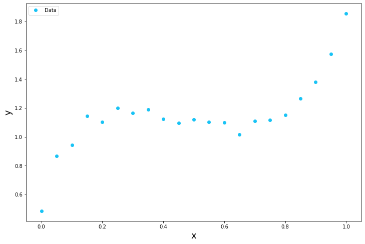
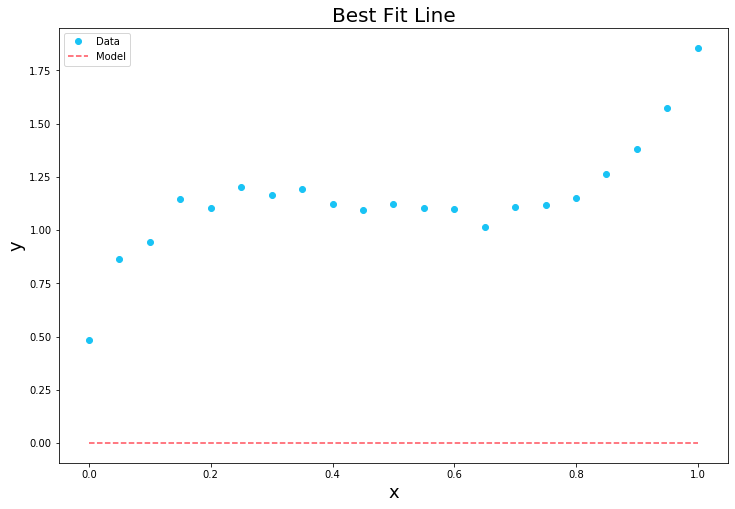
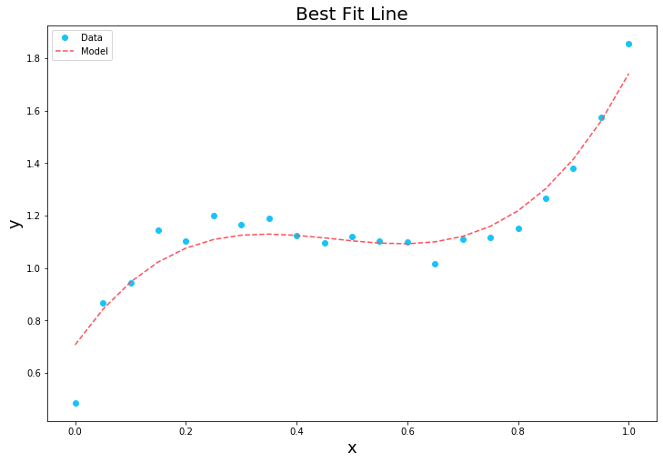

Plugin Example
==============

This is a quick example demonstrating the use of ModOpt in the context
of a PySAP plugin. In this example the Forward Backward algorithm from
ModOpt is used to find the best fitting line to a set of data points.

--------------

First we import the required packages.

.. code:: python

    import numpy as np
    import matplotlib.pyplot as plt
    from modopt import opt

Then we define a couple of utility functions for the puroposes of this
example.

.. code:: python

    def regression_plot(x1, y1, x2=None, y2=None):
        """Plot data points and a proposed fit.
        """

        fig = plt.figure(figsize=(12, 8))
        plt.plot(x1, y1, 'o', color="#19C3F5", label='Data')
        if not all([isinstance(var, type(None)) for var in (x2, y2)]):
            plt.plot(x2, y2, '--', color='#FF4F5B', label='Model')
            plt.title('Best Fit Line', fontsize=20)
        plt.xlabel('x', fontsize=18)
        plt.ylabel('y', fontsize=18)
        plt.legend()
        plt.show()

    def y_func(x, a):
        """Equation of a polynomial line.
        """

        return sum([(a_i * x ** n) for a_i, n in zip(a, range(a.size))])

--------------

The Problem
-----------

Image we have the following set of data points and we want to find the
best fitting 3\ :math:`^{\textrm{rd}}` degree polynomial line.

.. code:: python

    # A range of positions on the x-axis
    x = np.linspace(0.0, 1.0, 21)

    # A set of positions on the y-axis
    y = np.array([0.486, 0.866, 0.944, 1.144, 1.103, 1.202, 1.166, 1.191, 1.124, 1.095, 1.122, 1.102, 1.099, 1.017,
                  1.111, 1.117, 1.152, 1.265, 1.380, 1.575, 1.857])

    # Plot the points
    regression_plot(x, y)

This corresponds to solving the inverse problem

.. math:: y = Ha

where :math:`y` are the points on the y-axis, :math:`H` is a matirx
coposed of the points in the x-axis

.. code:: python

    H = np.array([np.ones(x.size), x, x ** 2, x ** 3]).T

and :math:`a` is a model describing the best fit line that we aim to
recover.

   Note: We could easily solve this problem analytically.

--------------

ModOpt solution
---------------

Let’s attempt to solve this problem using the Forward Backward algorithm
implemented in ModOpt in a few simple steps.

Step 1: Set an initial guess for :math:`a`
^^^^^^^^^^^^^^^^^^^^^^^^^^^^^^^^^^^^^^^^^^

We will start asumming :math:`a` is a vector of zeros, which is
obviously a very bad fit to the data.

.. code:: python

    a_0 = np.zeros(4)

    regression_plot(x, y, x, y_func(x, a_0))

Step 2: Define a gradient operator for the problem
^^^^^^^^^^^^^^^^^^^^^^^^^^^^^^^^^^^^^^^^^^^^^^^^^^

For this problem we can use the basic gradient provided in ModOpt

.. math:: \nabla F(x) = H^T(Hx - y)

we simply need to define the operations of :math:`H` and :math:`H^T`.

.. code:: python

    grad_op = opt.gradient.GradBasic(y, lambda x: np.dot(H, x), lambda x: np.dot(H.T, x))

.. parsed-literal::

    WARNING: Making input data immutable.

Step 3: Define a proximity operator for the algorithm
^^^^^^^^^^^^^^^^^^^^^^^^^^^^^^^^^^^^^^^^^^^^^^^^^^^^^

Since we don’t need to implement any regularisation we simply set the
identity operator.

.. code:: python

    prox_op = opt.proximity.IdentityProx()

Step 4: Pass everything to the algorithm
^^^^^^^^^^^^^^^^^^^^^^^^^^^^^^^^^^^^^^^^

Here we pass the initial guess for :math:`a` along with the gradient and
proximity operators we defined. We also specify a value for the
:math:`\beta` parameter in the Forward Backward algorithm. Finally, we
specify that we want a maximum of 500 iterations.

.. code:: python

    alg = opt.algorithms.ForwardBackward(a_0, grad_op, prox_op, beta_param=0.01, auto_iterate=False)
    alg.iterate(max_iter=500)

.. parsed-literal::

    100% (500 of 500) \|######################\| Elapsed Time: 0:00:00 Time:  0:00:00

.. parsed-literal::

     - ITERATION: 1
     - DATA FIDELITY (X): 6.931639464572723
     - COST: 6.931639464572723

     - ITERATION: 2
     - DATA FIDELITY (X): 3.4179113043303198
     - COST: 3.4179113043303198

     - ITERATION: 3
     - DATA FIDELITY (X): 1.7894732608136656
     - COST: 1.7894732608136656

     - ITERATION: 4
     - DATA FIDELITY (X): 0.8712577337041495
     - COST: 0.8712577337041495

     - CONVERGENCE TEST -
     - CHANGE IN COST: 2.8897396205130526

    ...

     - ITERATION: 499
     - DATA FIDELITY (X): 0.05534231539479718
     - COST: 0.05534231539479718

     - ITERATION: 500
     - DATA FIDELITY (X): 0.05498126500595005
     - COST: 0.05498126500595005

     - CONVERGENCE TEST -
     - CHANGE IN COST: 0.013163437152771431

Step 5: Extract the final result
^^^^^^^^^^^^^^^^^^^^^^^^^^^^^^^^

Once the algorithm has finished running we take the final result. We can
see that it’s a pretty good fit!

.. code:: python

    a = alg.x_final

    regression_plot(x, y, x, y_func(x, a))

--------------

PySAP Plugin
------------

Now imagine we want to implement the above solution as a PySAP plugin.
To do so we would first need to is create a new repository using the
PySAP plugin template (https://github.com/CEA-COSMIC/pysap-extplugin).

Afterwards, we could package our solution as a more user friendly
function.

.. code:: python

    def poly_fit(x, y, deg=3):

        H = np.array([np.ones(x.size), x, x ** 2, x ** 3]).T
        a_0 = np.zeros(4)
        grad_op = opt.gradient.GradBasic(y, lambda x: np.dot(H, x), lambda x: np.dot(H.T, x))
        prox_op = opt.proximity.IdentityProx()
        cost_op = opt.cost.costObj(operators=[grad_op, prox_op], verbose=False)
        alg = opt.algorithms.ForwardBackward(a_0, grad_op, prox_op, cost_op, beta_param=0.01, auto_iterate=False,
                                             progress=False)
        alg.iterate(max_iter=500)

        return alg.x_final

Once the plugin (let’s call it foo) was integrated it would be possible
to call this function as follows:

.. code:: python

   from pysap.plugins.foo import poly_fit

Then we could use this function to fit our data directly.

.. code:: python

    a_new = poly_fit(x, y)

    regression_plot(x, y, x, y_func(x, a_new))

